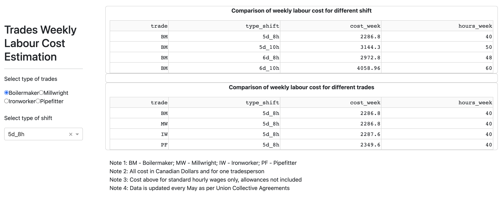

# Trades Labour Cost

[Hosted on onrender.com](https://trades-labour-cost.onrender.com/)

***A simple visualization tool for estimators working with trades labour costing in the construction industry.***

## Welcome!

Welcome to the repository of the Trades Labour Cost App！

Thank you for visiting the project, hope all of you can enjoy exploring the trades labour costs.

This document provides basic information of this Trades Labour Cost App. Please feel free to navigate each section by the list below:

-   [What are we doing?](#what-are-we-doing)
-   [Description of App](#description-of-app)
-   [Sketch](#sketch)
-   [Contributors](#contributors)
-   [Usage](#usage)
-   [How can you get involved?](#get-involved)

## What are we doing?

### The problem

As a project estimator in the construction industry, what is the weekly labour cost for different scenarios when working with various trades and shift schedule?

This seems like a simple question to be answered. However, when dealing with a large number of trade unions that all have different rates and conditions, a quick tool is needed for estimators to check with different scenarios and figure out best options of shift for a particular project.

### The solution

The Trades Labour Cost App will:

-   Enable estimators in the construction industry to effectively and efficiently compare weekly labour costs for different trades (currently the app only includes boilermaker, millwright, ironworker, and pipefitter trades in four union locals) and for different shift options.
-   Help estimators to manage various of wage/benefit rates, overall labour costing via data visualization.

## Description of App

The Dash app contains two main panels.

On the left side, from the radio butters, users will select the type of trades they are interested, and also through a drop-down, they can choose four commonly used work shift options.

On the right side, there are two data tables to show the comparison of weekly labour costs per trades, and the comparison of weekly labour costs per shift type. The results are automatically updated according to the user's selections on the left side.

We are planning to add more data and more features in the app in the future to make it more valuable to solve practical industrial problems. Currently, there are below assumptions to be aware of by users:

-   Hourly rates include wage and benefit according to the union agreements, and on top of them, all the employer responsible CPP/EI contributions have also been added. However, other costs, such as living out allowance, meal allowance not included.

-   Referring to the proposal of this project, currently the weekly trades labour cost results obtained from the app is only applicable for four exclusively mentioned union locals.

## Sketch

## Contributors

The contributor of this project is Peng Zhang.

## Usage

To install `trades_labourcost` locally, you can:

1.  Clone this repository with:

<!-- -->

    git clone https://github.com/pengzh313/trades_labourcost

2.  Navigate to your local repository and prompt the command line and run:

<!-- -->

    conda env create --file dash_labourcost.yaml

After the specific environment created, activate the new environment by:

    conda activate dash_labourcost

3.  Finally, run the app locally by below two options:

-   Open `VSCode`, navigate to the `src` folder under the `root` directory of the project, open `app.py` and run it by clicking `Run Python file` button on the top-right corner.

-   Open a command line, navigate to the `src` folder under the `root` directory of the project, run the following command to run the app locally:

<!-- -->

    python app.py

## Get involved

If you have any new ideas and suggestions for improvement about this app, please feel free to contact us via Github issues.

Please note that it's very important to us that we maintain a positive and supportive environment for everyone who wants to participate. You can check the code of conduct for more details if you want to be with us.

# License

`trades_labourcost` is licensed under the terms of the MIT license. Please refer to the License File [here](https://github.com/UBC-MDS/nba_player_stat/blob/main/LICENSE)

# Reference

The raw data came from the author's previous work in Manitoba, Canada. They were originally extracted and processed from the publicly available wage and benefit schedule of union collective agreements.
